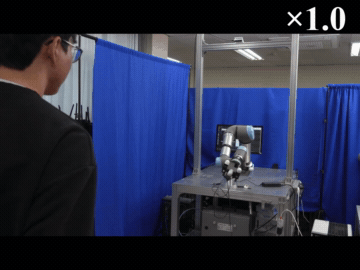
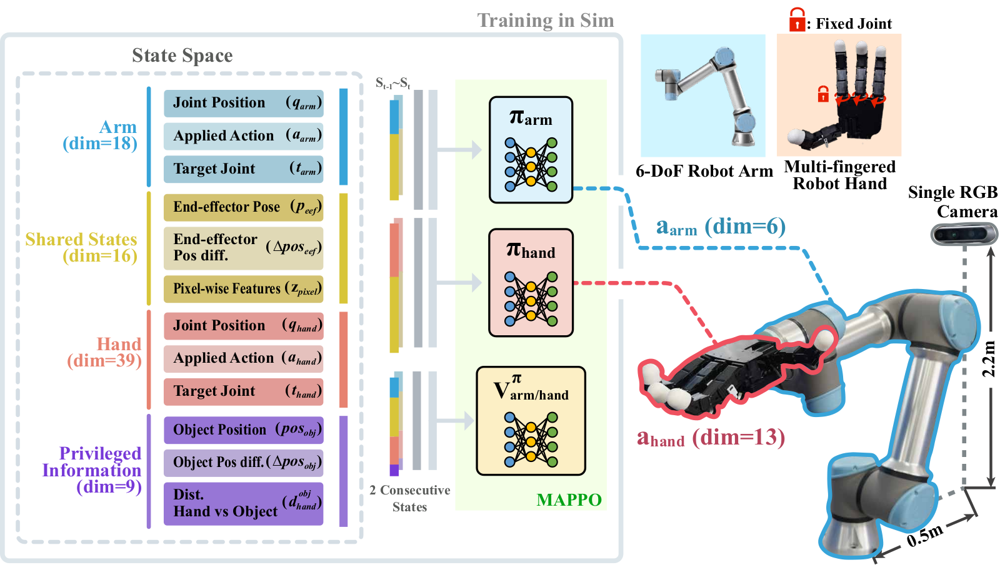

<div align="center">

<h1>Pixel2Catch: Multi-Agent Sim-to-Real Transfer for Agile Manipulation with a Single RGB Camera</h1>

<p>
  <strong>Seongyong Kim, Junhyeon Cho, Kang-Won Lee, and Soo-Chul Lim</strong><br/>
  <em>Dongguk University</em>
</p>

<!-- TODO: replace the "#" links for Paper and Video with the real URLs. -->
<p>
  <a href="#" target="_blank" rel="noopener noreferrer"></a>
  <a href="https://seongdrgn.github.io/pixel2catch/" target="_blank" rel="noopener noreferrer"></a>
  <a href="#" target="_blank" rel="noopener noreferrer"></a>
</p>

<table>
<tr>
<td align="center"><br/><b>Cube</b></td>
<td align="center"><br/><b>L-block</b></td>
<td align="center"><br/><b>Triangle</b></td>
</tr>
</table>

<sub><em>Real-world demonstrations (full clips, original speed) of zero-shot catching of human-thrown objects from a
single RGB camera. Policies are trained entirely in simulation and transferred directly to the real robot without
fine-tuning. Full videos on the <a href="https://seongdrgn.github.io/pixel2catch/">project page</a>.</em></sub>

</div>

---

## 🎉 News

- **[May 25, 2026]** Pixel2Catch has been accepted to _IEEE Robotics and Automation Letters (RA-L) 2026_! 🎉

---

## Overview

**Pixel2Catch** catches thrown objects from a **single RGB camera**, recognizing object motion via **pixel-level
features from consecutive RGB frames** instead of explicit 3D position. The arm and hand are trained as a
**heterogeneous multi-agent (MARL)** system and transfer **zero-shot from simulation to the real world**.

This repository releases the **simulation training code**: the environment, its configuration, the MAPPO agent
config, and the simulation assets needed to reproduce training.

> **Training algorithm.** Pixel2Catch is trained with the **MAPPO algorithm from Isaac Lab's built-in
> [skrl](https://skrl.readthedocs.io) integration, used without any modification** (verified identical to upstream
> `skrl==1.4.3`). No custom RL library is shipped — the policy is produced by Isaac Lab's standard skrl runner driven
> by [`catchpolicy/agents/pixel2catch.yaml`](catchpolicy/agents/pixel2catch.yaml).

### Contributions

- 📷 **Pixel-level object motion** — a single RGB camera; object motion is represented by image-space features instead of explicit 3D position.
- 🤝 **Single-stage heterogeneous MARL** — a high-DoF arm+hand system decomposed into two agents, each with role-specific observations and rewards.
- 🔁 **Zero-shot sim-to-real** — system identification + domain randomization enable agile, stable catching of human-thrown objects from RGB input alone.

---

## Method

<div align="center">
  
</div>

The catching task is formulated as a **Multi-Agent Markov Decision Process (MAMDP)** and solved with **MAPPO** under the
Centralized-Training / Decentralized-Execution (CTDE) paradigm:

- **Arm policy `π_arm` (dim=6)** — positions the end-effector to approach the thrown object.
- **Hand policy `π_hand` (dim=13)** — forms a stable grasp (the Allegro hand's 3 joints are fixed).
- **Pixel-level features** `z_pixel ∈ ℝ⁶ = {cₓ, c_y, Δcₓ, Δc_y, Δw, Δh}` — image-space center coordinates, width, and
  height (and their temporal differences), extracted from object segmentation. Observations are stacked over **2
  consecutive timesteps** to encode motion.
- **Privileged information** (object position, object position difference, hand–object distance) is used **only by the
  value network** during training — never by the policies — and is therefore not required at deployment.
- **Networks**: policy and value networks are 3 fully-connected layers `[512, 256, 128]` with **ELU** activations.

### Real-world system

- **Arm**: Universal Robots **UR5e** (6-DoF), table-mounted at 0.81 m.
- **Hand**: **Allegro Hand** (13 controlled joints), target joint-position control.
- **Camera**: a single **Intel RealSense D435**, **RGB only** (no depth), mounted 0.5 m behind and 2.2 m above the robot.
- **Perception**: **SAM 2** segments the object and produces the pixel-level features; policy inference runs at **30 Hz** over **ROS 2**.

---

## Installation

### Prerequisites

- Ubuntu 22.04
- NVIDIA GPU + recent driver (RTX-class recommended for camera / tiled rendering)
- Python 3.10 (Conda recommended)

### 1. Install Isaac Sim & Isaac Lab

Follow the official guide and finish a working installation first:
https://isaac-sim.github.io/IsaacLab/main/source/setup/installation/index.html

### 2. Install Python dependencies

With the Isaac Lab conda environment **active**:

```bash
pip install -r requirements.txt   # skrl==1.4.3 (Isaac Lab's MAPPO backend)
```

### 3. Integrate the Pixel2Catch task into Isaac Lab

Pixel2Catch is an Isaac Lab **direct** task. Isaac Lab auto-discovers every sub-package under
`isaaclab_tasks/direct/` (via `import_packages` in `isaaclab_tasks/__init__.py`), so simply placing the `catchpolicy/`
folder there is enough to register the task — **no code edits or manual imports are required.**

```bash
# from the root of this repository, point ISAACLAB_ROOT at your Isaac Lab clone
export ISAACLAB_ROOT=/path/to/IsaacLab

# Option A — copy
cp -r catchpolicy \
  "$ISAACLAB_ROOT/source/isaaclab_tasks/isaaclab_tasks/direct/"

# Option B — symlink (keeps this repo as the single source of truth)
ln -s "$(pwd)/catchpolicy" \
  "$ISAACLAB_ROOT/source/isaaclab_tasks/isaaclab_tasks/direct/catchpolicy"
```

**Verify** the task is registered:

```bash
cd "$ISAACLAB_ROOT"
python scripts/environments/list_envs.py | grep pixel2catch
```

The robot/table USD assets are bundled under `catchpolicy/assets/` and resolved relative to the package (no absolute
paths), so no extra asset setup is needed. Thrown objects are generated procedurally, so no object USD library is
required.

---

## Training

Run from the Isaac Lab root. Training uses Isaac Lab's built-in skrl trainer with `MAPPO`. The paper trains with
**512 parallel environments** (across 2× NVIDIA RTX A6000):

```bash
python scripts/reinforcement_learning/skrl/train.py \
    --task pixel2catch \
    --algorithm MAPPO \
    --num_envs 512 \
    --headless
```

A control decimation of 4 yields a **30 Hz** control policy on a **120 Hz** physics simulation, matching the real-robot
control loop. Logs and checkpoints are written to `logs/skrl/pixel2catch/`.

## Evaluation / Play

```bash
python scripts/reinforcement_learning/skrl/play.py \
    --task pixel2catch \
    --algorithm MAPPO \
    --num_envs 16 \
    --checkpoint /path/to/logs/skrl/pixel2catch/<run>/checkpoints/best_agent.pt
```

## Monitoring (TensorBoard)

```bash
./isaaclab.sh -p -m tensorboard.main --logdir=logs/skrl/pixel2catch
```

---

## Repository Layout

```
pixel2catch-github/
├── README.md
├── requirements.txt
├── .gitignore
├── docs/                          # figures used in this README
└── catchpolicy/                   # Isaac Lab direct task (drop into .../direct/)
    ├── __init__.py                # registers the `pixel2catch` Gym task
    ├── pixel2catch.py             # DynamicCatchEnv — environment logic
    ├── pixel2catch_cfg.py         # DynamicCatchEnvCfg — scene / sensors / rewards
    ├── agents/
    │   ├── __init__.py
    │   └── pixel2catch.yaml        # MAPPO agent config (skrl)
    └── assets/                     # simulation assets only
        ├── allegroUR5e/            # UR5e + Allegro hand (USD + meshes)
        └── table.usd
```

---

## Citation

If you find this work useful, please cite:

```bibtex
@article{kim2026pixel2catch,
  title   = {Pixel2Catch: Multi-Agent Sim-to-Real Transfer for Agile Manipulation with a Single RGB Camera},
  author  = {Kim, Seongyong and Cho, Junhyeon and Lee, Kang-Won and Lim, Soo-Chul},
  journal = {IEEE Robotics and Automation Letters (RA-L)},
  year    = {2026}
}
```

## Acknowledgements

This work was supported by the National Research Foundation of Korea (NRF) grant funded by the Korea government (MSIT)
(RS-2025-00562981, RS-2025-25433409).

Built on [Isaac Lab](https://github.com/isaac-sim/IsaacLab) and the [skrl](https://github.com/Toni-SM/skrl)
reinforcement learning library, and uses [SAM 2](https://github.com/facebookresearch/sam2) for object segmentation. We
thank their authors and maintainers.

## Contact

- Seongyong Kim (first author) — `sykim_414@dgu.ac.kr`
- Soo-Chul Lim (corresponding author) — `limsc@dongguk.edu`

<!-- TODO: choose a license (e.g. BSD-3-Clause, MIT) and add a LICENSE file -->
