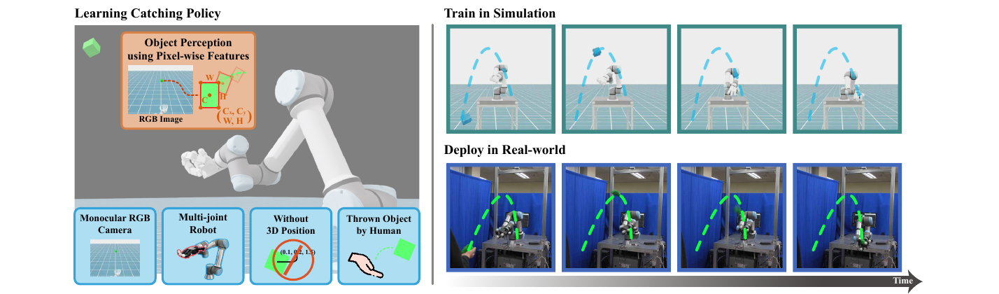

<div align="center">

<h1>🤖 Pixel2Catch</h1>

<h3>Multi-Agent Sim-to-Real Transfer for Agile Manipulation<br/>with a Single RGB Camera</h3>

<!-- TODO: replace with the author list from the paper -->
<p><em>TODO — Author One, Author Two, Author Three</em></p>

<p>
  <a href="https://www.ieee-ras.org/publications/ra-l">
    
  </a>
</p>

<!-- 🎉 Acceptance banner 🎉 -->
<p>
  
</p>

> ### 🎉 Great news — Pixel2Catch has been **accepted to IEEE Robotics and Automation Letters (RA-L) 2026**! Congratulations to the team! 🎉

<!--
  TODO: replace the "#" links for Paper and Video with the real URLs.
-->
<p>
  <a href="#"></a>
  <a href="https://seongdrgn.github.io/pixel2catch/"></a>
  <a href="#"></a>
</p>

<!-- TODO: add the paper teaser figure here, e.g. ./docs/teaser.png -->
<!--  -->

</div>

---

## Overview

**Pixel2Catch** learns an agile, dynamic object-**catching** policy for a UR5e arm equipped
with an Allegro hand, using **only a single RGB camera** as the exteroceptive sensor. The arm
(approach) and the hand (grasp) are formulated as two cooperating agents and trained jointly
with **MAPPO** (Multi-Agent PPO) in [Isaac Lab](https://isaac-sim.github.io/IsaacLab/), then
transferred to the real world (**sim-to-real**) directly from pixels.

This repository releases the **simulation training code** for the Pixel2Catch task:
the environment, its configuration, the multi-agent (MAPPO) agent config, and the simulation
assets needed to reproduce training.

> **Training algorithm.** Pixel2Catch is trained with the **MAPPO algorithm from Isaac Lab's
> built-in [skrl](https://skrl.readthedocs.io) integration, used without any modification**
> (verified identical to upstream `skrl==1.4.3`). No custom RL library is shipped — the policy
> is produced by Isaac Lab's standard skrl runner driven by
> [`catchpolicy/agents/pixel2catch.yaml`](catchpolicy/agents/pixel2catch.yaml).

---

## Key Features

- 🎥 **Single RGB camera** — pixel observations only, no depth / motion capture / object pose.
- 🤝 **Multi-agent (MAPPO)** — arm and hand as cooperating agents, jointly trained.
- ⚡ **Agile dynamic catching** — catch objects thrown into the workspace.
- 🔁 **Sim-to-real** — policy transfers from Isaac Lab simulation to hardware.
- 🧩 **Drop-in Isaac Lab task** — auto-registered as the `pixel2catch` Gym environment.

---

## Installation

### Prerequisites

- Ubuntu 22.04
- NVIDIA GPU + recent driver (RTX-class recommended for camera / tiled rendering)
- Python 3.10 (Conda recommended)

### 1. Install Isaac Sim & Isaac Lab

Follow the official guide and finish a working installation first:
https://isaac-sim.github.io/IsaacLab/main/source/setup/installation/index.html

### 2. Install Python dependencies

With the Isaac Lab conda environment **active**:

```bash
pip install -r requirements.txt   # skrl==1.4.3 (Isaac Lab's MAPPO backend)
```

### 3. Integrate the Pixel2Catch task into Isaac Lab

Pixel2Catch is an Isaac Lab **direct** task. Isaac Lab auto-discovers every sub-package under
`isaaclab_tasks/direct/` (via `import_packages` in `isaaclab_tasks/__init__.py`), so simply
placing the `catchpolicy/` folder there is enough to register the task — **no code edits or
manual imports are required.**

```bash
# from the root of this repository, point ISAACLAB_ROOT at your Isaac Lab clone
export ISAACLAB_ROOT=/path/to/IsaacLab

# Option A — copy
cp -r catchpolicy \
  "$ISAACLAB_ROOT/source/isaaclab_tasks/isaaclab_tasks/direct/"

# Option B — symlink (keeps this repo as the single source of truth)
ln -s "$(pwd)/catchpolicy" \
  "$ISAACLAB_ROOT/source/isaaclab_tasks/isaaclab_tasks/direct/catchpolicy"
```

**Verify** the task is registered:

```bash
cd "$ISAACLAB_ROOT"
python scripts/environments/list_envs.py | grep pixel2catch
```

You should see the `pixel2catch` task listed. The robot/table USD assets are bundled under
`catchpolicy/assets/` and resolved relative to the package (no absolute paths), so no extra
asset setup is needed. Thrown objects are generated procedurally, so no object USD library is
required.

---

## Training

Run from the Isaac Lab root. Training uses Isaac Lab's built-in skrl trainer with `MAPPO`:

```bash
python scripts/reinforcement_learning/skrl/train.py \
    --task pixel2catch \
    --algorithm MAPPO \
    --num_envs 4096 \
    --headless
```

Logs and checkpoints are written to `logs/skrl/pixel2catch/` (configured by the `experiment`
block in `pixel2catch.yaml`).

## Evaluation / Play

```bash
python scripts/reinforcement_learning/skrl/play.py \
    --task pixel2catch \
    --algorithm MAPPO \
    --num_envs 16 \
    --checkpoint /path/to/logs/skrl/pixel2catch/<run>/checkpoints/best_agent.pt
```

## Monitoring (TensorBoard)

```bash
./isaaclab.sh -p -m tensorboard.main --logdir=logs/skrl/pixel2catch
```

---

## Repository Layout

```
pixel2catch-github/
├── README.md
├── requirements.txt
├── .gitignore
└── catchpolicy/                  # Isaac Lab direct task (drop into .../direct/)
    ├── __init__.py               # registers the `pixel2catch` Gym task
    ├── pixel2catch.py            # DynamicCatchEnv — environment logic
    ├── pixel2catch_cfg.py        # DynamicCatchEnvCfg — scene / sensors / rewards
    ├── agents/
    │   ├── __init__.py
    │   └── pixel2catch.yaml       # MAPPO agent config (skrl)
    └── assets/                    # simulation assets only
        ├── allegroUR5e/           # UR5e + Allegro hand (USD + meshes)
        └── table.usd
```

---

## Citation

If you find this work useful, please cite:

```bibtex
@article{pixel2catch,
  title   = {Pixel2Catch: Multi-Agent Sim-to-Real Transfer for Agile Manipulation with a Single RGB Camera},
  author  = {TODO},
  journal = {IEEE Robotics and Automation Letters (RA-L)},
  year    = {2026}
}
```

## Acknowledgements

Built on [Isaac Lab](https://github.com/isaac-sim/IsaacLab) and the
[skrl](https://github.com/Toni-SM/skrl) reinforcement learning library. We thank their authors
and maintainers.

## License

<!-- TODO: choose a license (e.g. BSD-3-Clause, MIT) and add a LICENSE file -->
TBD
